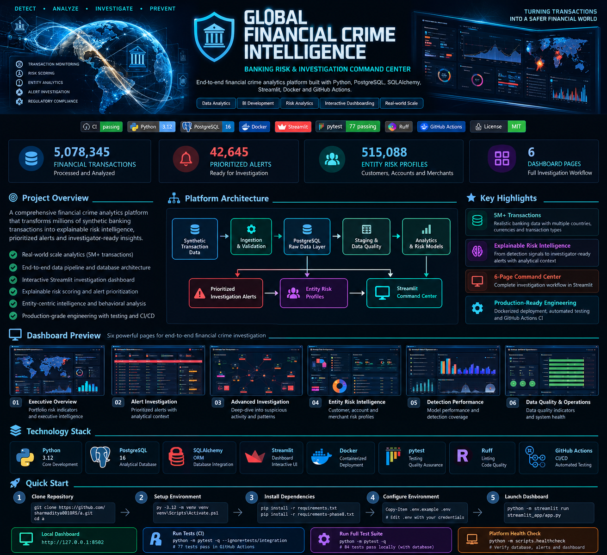
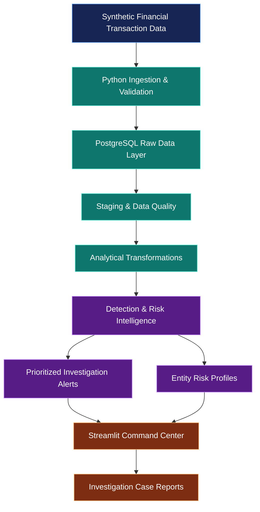
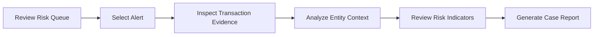

<p align="center">
  
</p>

# Global Financial Crime Intelligence
### Banking Risk & Investigation Command Center

**An end-to-end financial crime analytics platform built with Python, PostgreSQL, SQLAlchemy, Streamlit, Docker and GitHub Actions.**

Transforming millions of synthetic financial transactions into explainable risk intelligence, prioritized alerts and investigator-ready insights.

[](https://github.com/sharmaditya0010RS/a/actions/workflows/ci.yml)


---

## 🚀 At a Glance

| 📊 Financial Transactions | 🚨 Prioritized Alerts | 🧠 Entity Risk Profiles | 🖥️ Dashboard Pages |
|:---:|:---:|:---:|:---:|
| **5,078,345** | **42,645** | **515,088** | **6** |

> **Mission:** Build an explainable, analyst-focused financial crime intelligence system that bridges data engineering, risk analytics and investigative workflows.

This project demonstrates how raw transaction data can be transformed into structured banking intelligence using a reproducible analytical pipeline.

**Important:** All financial data used for this portfolio is synthetic. Risk indicators are investigative signals, not findings of criminal conduct.

---

## ✨ What Makes This Project Different?

**01 — Realistic analytical scale**

Process and analyze more than **5 million financial transactions** using a PostgreSQL-backed architecture.

**02 — Explainable risk prioritization**

Transform detection signals into a prioritized investigation queue with traceable analytical context.

**03 — Entity-centric intelligence**

Move beyond individual transactions to investigate behavioral patterns and entity-level risk.

**04 — Investigator-focused experience**

Explore alerts, related activity, detection performance and data quality through a six-page Streamlit command center.

**05 — Engineering and deployment discipline**

Use containerized deployment, automated health checks, Python testing, linting and GitHub Actions CI.

---

## 🏗️ Platform Architecture



### Architecture Principles

- **Layered data processing:** Separate ingestion, staging, analytics and investigation.
- **SQL-first analytical storage:** Use PostgreSQL for structured financial intelligence.
- **Explainability:** Preserve context behind alerts and entity risk indicators.
- **Operational visibility:** Expose data quality, health checks and detection performance.
- **Reproducibility:** Version code, configuration templates and deployment instructions.

---

## 🖥️ The Six-Page Command Center

| Page | Purpose |
|---|---|
| **01 · Executive Overview** | Monitor portfolio-level risk indicators, alert volumes and executive intelligence |
| **02 · Alert Investigation** | Examine prioritized alerts and supporting transaction context |
| **03 · Advanced Investigation** | Explore deeper investigative patterns and related activity |
| **04 · Entity Risk Intelligence** | Analyze entity-level risk profiles and behavioral indicators |
| **05 · Detection Performance** | Understand detection outputs, coverage and prioritization |
| **06 · Data Quality & Operations** | Review data quality indicators and operational reliability |

The dashboard is designed for both executive monitoring and analyst-driven investigation.

### Dashboard Preview

*Dashboard screenshots will be added in the final portfolio presentation release.*

**Local dashboard:** `http://127.0.0.1:8502`

---

## 🔎 Investigation Workflow



The investigation experience supports a structured transition from a high-level risk signal to a more detailed case narrative.

### Risk Prioritization

The analytical layer supports multiple priority levels for investigation triage.

| Priority | Interpretation |
|---|---|
| **P1** | Critical review priority |
| **P2** | High review priority |
| **P3** | Medium review priority |
| **P4** | Lower review priority |

Priority is a workflow aid, not a legal determination or proof of suspicious activity.

---

## 📊 Analytical Snapshot

The validated local portfolio includes:

| Metric | Observed Value |
|---|---:|
| Transactions processed | 5,078,345 |
| Prioritized alerts | 42,645 |
| Entity risk profiles | 515,088 |
| P1 alerts | 0 |
| P2 alerts | 22 |
| P3 alerts | 5,512 |
| P4 alerts | 37,111 |

These figures describe the validated synthetic dataset and are not guaranteed to match a fresh installation.

---

## 🧰 Technology Stack

| Layer | Technology |
|---|---|
| Programming | Python 3.12 |
| Analytical database | PostgreSQL 16 |
| Database integration | SQLAlchemy, psycopg |
| Dashboard | Streamlit |
| Containerization | Docker |
| Automated testing | pytest |
| Code quality | Ruff |
| CI/CD foundation | GitHub Actions |
| Source control | Git, GitHub |

---

## ⚙️ Getting Started

### Prerequisites

- Python 3.12
- Docker Desktop
- Git
- PostgreSQL 16, through the project's existing Docker setup

### 1. Clone the Repository

```bash
git clone https://github.com/sharmaditya0010RS/a.git
cd a
```

### 2. Create a Virtual Environment

On Windows PowerShell:

```powershell
py -3.12 -m venv venv
.\venv\Scripts\Activate.ps1
```

### 3. Install Dependencies

```powershell
python -m pip install --upgrade pip
pip install -r requirements.txt
pip install -r requirements-phase8.txt
```

### 4. Configure Environment Variables

```powershell
Copy-Item .env.example .env
notepad .env
```

Replace placeholder credentials with values appropriate for your own environment.

### 5. Prepare the Database

This project uses PostgreSQL and requires the relevant analytical schema and populated synthetic data for its full dashboard experience.

A fresh database alone does **not** contain the validated 5-million-transaction portfolio.

See [Deployment Guide](docs/DEPLOYMENT.md) for details of the validated local deployment.

### 6. Launch Streamlit

```powershell
python -m streamlit run streamlit_app/app.py
```

The local Streamlit development server will display its access URL in the terminal.

For the validated Docker deployment, the dashboard is available at:

`http://127.0.0.1:8502`

---

## 🧪 Testing & Quality Assurance

The project includes unit and database integration testing.

### Database-Independent Tests

```powershell
python -m pytest -q --ignore=tests/integration
```

**Validated:** 77 tests passed.

### Full Test Suite

```powershell
python -m pytest -q
```

**Validated locally:** 84 tests passed against the populated PostgreSQL environment.

### Linting

```powershell
ruff check scripts streamlit_app tests
```

### Platform Health Check

```powershell
python -m scripts.healthcheck
```

The health check verifies database connectivity, the prioritized alert view and dashboard HTTP health.

### GitHub Actions

The GitHub Actions workflow automatically runs database-independent tests, linting and Python compilation.

[**View CI Pipeline →**](https://github.com/sharmaditya0010RS/a/actions)

Database-dependent integration tests are currently validated locally, not in GitHub-hosted CI.

---

## 🐳 Docker Deployment

The application has been built and validated as a Dockerized Streamlit dashboard connected to an existing PostgreSQL container.

**Validated local deployment:**

| Component | Configuration |
|---|---|
| Dashboard container | `fci_dashboard_phase10` |
| PostgreSQL container | `fci_postgres` |
| Docker network | `fci_network` |
| Dashboard URL | `http://127.0.0.1:8502` |
| Database | `aml_analytics` |

> **Deployment caution:** The documented container setup depends on an existing populated database. Do not delete PostgreSQL volumes when experimenting with the deployment.

For operational commands and limitations, see [Deployment Documentation](docs/DEPLOYMENT.md).

---

## 🧭 Engineering Journey

| Milestone | Focus |
|---|---|
| **Foundation** | Repository structure, Python configuration and database setup |
| **Data Engineering** | Raw ingestion, staging and data validation |
| **Financial Crime Analytics** | Detection signals, alert prioritization and entity intelligence |
| **Investigation Experience** | Analyst workflows, dashboard pages and case reporting |
| **Operational Readiness** | Testing, health checks, Docker and GitHub Actions |
| **Portfolio Finalization** | Documentation, screenshots and demonstration assets |

**Current release milestone:** `v0.10.0-phase10`

---

## ⚠️ Scope & Analytical Limitations

This is a financial crime analytics portfolio project, not a production bank monitoring system.

- All portfolio transactions are synthetic.
- Risk scores and priority labels are heuristic analytical outputs.
- Alerts do not establish money laundering, fraud or other wrongdoing.
- Cross-currency transaction values are not FX-normalized.
- Generated investigation reports are not immutable legal evidence.
- The validated dataset is not automatically provisioned by cloning the repository.
- Authentication, authorization and enterprise security controls require additional production engineering.

---

## 🔮 Future Enhancements

- Automated PostgreSQL integration tests with disposable test fixtures
- Role-based investigator access and audit logging
- Configurable detection thresholds and rules
- Enhanced network and relationship analytics
- Reproducible synthetic demo dataset
- Hosted demonstration environment
- Improved case management and investigation lifecycle tracking

---

## 👨‍💻 Project Focus

**Financial Crime Analytics · Data Engineering · Risk Intelligence · Python · SQL · Dashboard Engineering**

Built as a practical portfolio demonstration of how large-scale transaction data can be transformed into structured, explainable financial risk intelligence.

---

<div align="center">

### 🛡️ From Transactions to Intelligence

**5M+ Transactions · 42K+ Alerts · 515K+ Risk Profiles**

*Designed for investigation. Built with engineering discipline.*

[Explore the Source Code](https://github.com/sharmaditya0010RS/a) · [View CI](https://github.com/sharmaditya0010RS/a/actions) · [Deployment Guide](docs/DEPLOYMENT.md)

</div>
